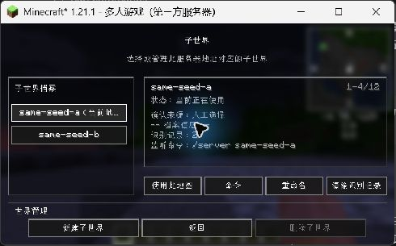
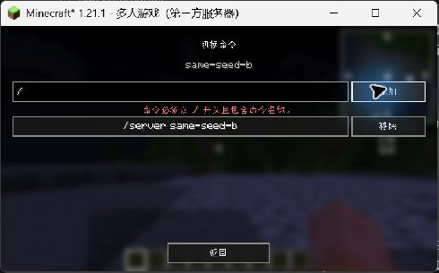
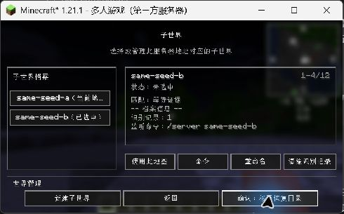

# 新的客户端子世界检测功能审计报告

> 审计日期：2026-08-12（Asia/Shanghai） 
> 审计对象：Conflux Map PR [#11](https://github.com/Conflux-Union/conflux-map/pull/11) `fix(multiworld): harden client subworld isolation and management UI` 
> 审计版本：`ec4dcc811523986327ebe5b3b66f96a5b2b5e1d4` 
> 对比基线：`d403d54174d6fc90db4d9f8bc2bcf4d9dafee3f6` 
> 分支：`fix/no-ticket-detect-client-subworlds` 
> 审计方式：三名专业 Agent 并行审计 + 主审计复核 + GitHub review thread 核验 + 定向测试 + Minecraft 实机交互检查

## 一、审计结论

**结论：阻止合并（BLOCK）。** 当前没有发现 P0，但确认 **9 项 P1、15 项 P2 和 8 组 P3**。在 P1 清零、受影响版本的运行时回归通过、版本矩阵全部有效通过之前，不应合并或发布。

最严重的风险不是单一识别算法偏差，而是识别、持久化、删除恢复和跨版本接入之间的组合失效：临时身份会被当成已确认访问写入档案；失败的删除事务恢复会被标记为成功；删除 profile 会遗漏含精确坐标的轨迹 checkpoint；删除前 flush 可以永久阻塞 UI；已有 schema 6 配置又会被当前 schema 4 误判成未来版本。

### 1.1 风险汇总

| 等级 | 数量 | 合并结论 | 代表性风险 |
|---|---:|---|---|
| P0 | 0 | 未发现立即造成全局灾难的确定性问题 | — |
| P1 | 9 | 必须修复后方可合并 | 身份污染、删除/恢复不完整、永久卡死、配置 schema 回退、版本接入缺失、持续写盘放大、短视口不可操作 |
| P2 | 15 | 应在合并前解决高概率项，或明确限定发布范围 | 快照错误路由、内存峰值、异步状态悬挂、键盘/无障碍缺口、迁移错误 |
| P3 | 8 组 | 可拆分后续维护任务，但必须建账 | 重复策略、超大类、每帧重建、术语与格式不一致 |

### 1.2 合并前最低准入条件

1. 9 项 P1 全部修复，并各有失败注入或回归测试。
2. Minecraft 版本矩阵不再包含 FAILURE/CANCELLED；特别验证 1.18.2、1.20.1、1.21.3、1.21.4 最终 jar 的 mixin 注册和真实连接流程。
3. 删除事务必须 fail-closed：flush/marker 超时或异常时中止删除，不允许继续移动目录。
4. 从 schema 6 升级、临时降级再升级、future schema 只读保护全部通过测试。
5. 在 1280×720、GUI Scale 4 下完成新建、重命名、解绑和删除确认的键盘操作回归。

## 二、范围与证据

### 2.1 多 Agent 分工

| 审计角色 | 负责范围 | 主要产出 |
|---|---|---|
| 正确性与安全 Agent | 状态机、数据隔离、删除/恢复、权限边界 | 临时身份污染、恢复假成功、轨迹遗漏、异步失败路径 |
| 性能与维护 Agent | 写盘/内存/线程、版本矩阵、配置迁移、维护成本 | schema 回退、4.7 GiB/小时最坏写放大、mixin 缺失、CI 接入错误 |
| UX 与可访问性 Agent | 任务流、键盘、反馈、短视口、术语 | footer 越界、焦点劫持、鼠标专属信息、错误文案重叠 |
| 主审计 | reviewer 意见裁决、实机操作、测试、交叉去重 | 13 个 inline thread 状态核验、风险定级和发布结论 |

### 2.2 实机操作证据

本轮直接操作了正在运行的 Minecraft 1.21.1，而不是只检查静态截图。实际完成以下无破坏性流程：

1. 打开全屏地图并进入“子世界管理”。
2. 切换当前/非当前 profile，验证详情与按钮状态联动。
3. 打开命令管理，输入非法 `/` 并提交，观察原页内红色错误提示。
4. 打开重命名页，确认名称预填与取消路径。
5. 点击“清除识别记录”第一阶段，观察按钮变为二次确认；未执行最终解绑。
6. 点击非当前 profile 的“删除”第一阶段，观察按钮变为“确认：移至恢复目录”；未执行最终删除。
7. 选择当前 profile，确认删除按钮禁用。
8. 打开新建页，确认空名称时完成按钮禁用，并用 Tab 移动焦点后取消。

实机结论：主路径可发现、当前 profile 删除保护和两阶段确认设计是有效的；但删除第二阶段没有实际执行，因为已确认其后端存在永久阻塞、恢复假成功和删除遗漏，继续执行会产生不必要的数据风险。当前自动化没有暴露可用的 accessibility tree，因此本报告不声称 Narrator 已通过；相关结论以代码和键盘路径为依据。

### 2.3 已执行验证

| 验证 | 结果 |
|---|---|
| `:common:test`：`ClientWorldProfileIoTest`、`ClientWorldTrajectoryTest`、`ClientWorldProfileResolverTest` | 通过，BUILD SUCCESSFUL |
| `:1.17.1:test`：`ClientMultiworldServiceTest`、`CompanionSessionTest`、`ClientWorldSelectScreenTest` | 通过，BUILD SUCCESSFUL |
| `:1.21.1:test`：`ClientMultiworldServiceTest`、`ClientWorldSelectScreenTest`、`ChatScreenMixinTest` | 通过，BUILD SUCCESSFUL |
| GitHub Minecraft matrix | 12 个版本中 9 PASS、1 FAILURE、2 CANCELLED |
| 1.21.3 失败日志 | build 成功，但连接 smoke 等待 300 秒后 `Timed out waiting for the client to connect` |
| Paper、Get-Versions | 通过 |

未执行：全量本地 Gradle 矩阵、Qodana、慢盘/磁盘故障注入、4 MiB registry benchmark、Narrator 验证、真实 1280×720/GUI Scale 4 的完整删除流程。未执行项不得视为通过。

## 三、十个审计维度

| 维度 | 结论 | 审计判断 |
|---|---|---|
| 核心功能完整性 | 不通过 | 识别/缓冲/确认模型基本齐全，但 provisional 可进入确认访问路径；四个版本漏注册聊天 mixin；PROBING/WAITING 快照可能写入当前地图 |
| 易用性与操作逻辑 | 有条件通过 | 入口、选择、当前 profile 保护和两阶段确认清楚；命令页焦点、键盘滚动、短视口布局仍会阻断任务 |
| 稳定性与数据安全 | 不通过 | 恢复失败被标记成功、删除遗漏轨迹、future schema 被隔离、flush 可永久挂起 |
| 性能 | 不通过 | 最坏每 3 秒深拷贝并重写 4 MiB registry；未解析快照可超过 42 MiB；预览和信号采集存在 O(N) 热点 |
| 反馈与错误处理 | 不通过 | 普通非法命令有反馈；删除失败、executor 拒绝、预览失败和恢复失败的错误终结/重试不足 |
| 兼容性 | 不通过 | schema 从 6 回退到 4；四个版本 mixin 缺失；1.20.1 smoke 参数错误；CI 尚未全绿 |
| 配置与管理能力 | 不通过 | profile、绑定和命令管理能力完整，但显式 60 秒配置被静默改成 3 秒，future schema 不能安全只读 |
| 权限与安全 | 不通过 | 没有发现新增外部权限；当前 profile 禁删和二次确认是优点，但“删除”未清除精确轨迹且恢复语义不可信 |
| 界面与可访问性 | 不通过 | 常规分辨率可用；短视口 footer 越界、鼠标专属 tooltip、焦点劫持和未验证 Narrator 阻碍合规 |
| 长期维护 | 不通过 | 75 文件、约 +15,593/-1,089 的超大 PR，三处策略重复、两处反序列化重复、多个 1,400–2,700 行大类；Sourcery 因 diff 过大跳过审查 |

## 四、P1：合并阻断问题

### A-01 配置 schema 从 6 回退到 4

- 维度：兼容性、配置与管理、数据安全
- 证据：`common/src/main/java/cn/net/rms/confluxmap/core/config/ConfluxConfig.java:16` 当前为 `SCHEMA_VERSION = 4`，PR base 为 6；`ConfigIoTest.java:216` 又硬编码期望 4。
- 触发：从当前 master/0.1.4-beta.1（schema 6）安装本 PR 构建。
- 影响：`ConfigIo.java:83-95` 把现有 schema 6 当 future；配置页随后保存会按旧模型覆盖文件并剥离未知字段。升级、临时回滚和再升级均不安全。
- 建议：schema 单调提升到至少 7；新增字段使用 presence-aware migration；future schema 下禁止写入或原样保留未知 JSON。
- 验收：补 schema 6→新版本、future load→save 不改字节、downgrade→upgrade 三组测试。

### A-02 临时 provisional 身份进入确认访问持久化路径

- 维度：核心功能、数据隔离、安全
- 证据：`ClientWorldResolution.java:46,64-72` 用 `State.RESOLVED` 同时表示 provisional；`ClientMultiworldService.java:667-680` 对 RESOLVED 无条件调用 `queueConfirmedProfileOwnedVisits()`；`1381-1414` 在检查 `!provisional` 前发布 prepared visit。
- 影响：未被地形/稳定信号确认的 profile 被写入档案，未来识别又用被污染的 visit 自我强化，可能把不同子世界地图混在一起。
- Reviewer：CodeRabbit 当前 thread 有效；“允许 provisional 在内存中保留缓冲”本身合理，错误在于确认持久化边界被绕过。
- 建议：引入独立 `PROVISIONAL` state 或单一 `confirmed()` predicate；公开 identity、锁定、visit 写入和 drain 只依赖该 predicate。
- 验收：service 层证明 provisional 不公开为已确认 identity、不 queue visit、不写 profile-owned 数据。

### A-03 删除事务恢复失败仍被标记为 recovered

- 维度：稳定性、数据安全、错误处理
- 证据：`ClientWorldProfileDeletionService.java:111-174` 的恢复函数吞下/记录错误但不返回失败；`ClientMultiworldService.java:1713-1729` 随后无条件标记 recovered 并继续开图。
- 影响：未恢复、损坏或 foreign journal 被当成成功，旧数据仍在原位置，新会话又开始写入，产生数据滞留、覆盖或分裂命名空间。
- 建议：恢复返回结构化结果；任何未完成 journal 均阻止 profile 服务启动，并提供可重试/人工恢复提示。
- 验收：损坏 journal、move 失败、部分恢复、重复恢复和 crash-after-each-step 故障注入。

### A-04 删除 profile 遗漏 profile-owned 轨迹 checkpoint

- 维度：数据安全、权限与安全、核心完整性
- 证据：`ClientWorldProfileDeletionService.java:43-78` 只移动 map、prediction、structures、waypoints、annotations；轨迹根在 `ClientMultiworldService.java:206-214`，文件包含精确位置/运动数据（`ClientWorldTrajectoryCheckpointIo.java:147-188,242-245`）。
- 影响：UI 声称删除/移至恢复目录，但精确坐标轨迹继续留在活跃位置；删除不完整且无法通过同一恢复事务还原。
- 建议：把 trajectory checkpoint 纳入同一 journal、move、restore、purge 清单；删除前列出作用域，删除后验证无残留。
- 验收：删除和恢复后逐项核对六类数据；测试坐标文件不存在/可恢复。

### A-05 删除前 flush/marker 可永久冻结 UI

- 维度：稳定性、性能、错误处理
- 证据：`RegionCacheService.java:88-130` 的 `flush.get()`、`marker.get()` 无 timeout；`RegionDiskCache.java:397-422` 只捕获 `RuntimeException`，`Error` 可令 future 永不结束；删除入口 `ClientMultiworldService.java:989-1005` 同步等待。
- 影响：慢盘、executor 死亡或 `writeRegion` 抛 Error 时，Minecraft 客户端线程永久无响应。
- Reviewer：Qodo 与 CodeRabbit 当前 thread 均有效。但 CodeRabbit“超时后继续删除”不安全；仍在运行的 flush 会与 move/delete 竞争并重建文件。
- 建议：设置统一总预算；timeout/ExecutionException 时 fail-closed 中止删除；所有 `Throwable` 路径都必须终结 future；UI 显示可重试错误。
- 验收：never-completing future、Error、interrupt、late flush race、超时后目录不移动。

### A-06 四个版本产物漏注册 ChatScreenMixin

- 维度：核心功能、兼容性
- 证据：根 `src/main/resources/confluxmap.mixins.json:10` 有注册；1.18.2、1.20.1、1.21.3 override 未包含，最终 build resource 还表明 1.21.4 也缺失；只有 1.21.1 override 补齐。
- 影响：这些版本通过聊天执行 `/server` 或代理切换命令时，`ClientWorldIdentityHandler.chatSubmitted` 不收到原始命令，命令锁和离开世界快照隔离静默失效。
- 建议：统一生成/合并 mixin 列表，检查每个最终 jar；不要只测试根源码字符串。
- 验收：四个版本最终 jar 资源断言 + 运行时 injection smoke + 代理切换 E2E。

### A-07 1.20.1 自动连接 smoke 使用不存在的 legacy 参数

- 维度：兼容性、发布治理
- 证据：`common.gradle:128-133` 把 Quick Play 阈值从 base 的 `>=12001` 改为 `>=12005`，1.20.1 因而使用 `--server/--port`；该版本 Main 实际支持 `quickPlayMultiplayer`，没有 legacy option。
- 影响：CI 的 1.20.1 自动连接不能按设计进服，版本门禁失真；当前 CANCELLED 不能当成通过。
- 建议：恢复正确阈值或根据版本能力生成参数，并对矩阵最终参数做断言。
- 验收：1.20.1 客户端真实自动连接到测试服且 job PASS。

### A-08 稳定状态每 3 秒深拷贝并重写整个 registry

- 维度：性能、稳定性、长期维护
- 证据：`ClientWorldPolicy.java:17,23` 默认/最小 3 秒；`ClientMultiworldService.java:2477-2517` 稳态也刷新；`ClientWorldProfileResolver.java:915-923` 深拷贝；`ClientWorldProfileIo.java:113-127` Gson 全量序列化并原子写，文件上限 4 MiB。
- 影响：主线程周期性 O(registry) 分配和 GC；最坏磁盘写放大约 `4 MiB / 3s ≈ 4.7 GiB/小时`，还会阻塞单 IO 队列。
- 建议：visit/trajectory 使用增量 journal 或 per-profile checkpoint；coalesce 写；元数据事件驱动、低频 checkpoint；prepare 不深拷贝全图。
- 验收：接近 4 MiB registry 的 P95 tick、分配、写入量 benchmark，并给出预算。

### A-09 低高度视口的 footer 和主操作按钮越界

- 维度：易用性、界面、可访问性
- 证据：`ClientWorldSelectScreen.java:1301` 计算 `footerTop=max(166,height-46)`；height=180 时 footer 操作从 y=184 到 204，主按钮可到 y=247；1280×720、GUI Scale 4 即为 320×180。现有测试只覆盖 height≥320。
- 影响：常见小窗口/高 GUI Scale 下新建、重命名、解绑、删除无法点击，关键管理任务被阻断。
- Reviewer：CodeRabbit 当前 thread 有效。
- 建议：把动作区纳入可滚动容器或使用紧凑响应式布局；保证 320×180 可操作。
- 验收：320×180 下鼠标与键盘都能完成全部流程，任何控件不越界、不重叠。

## 五、P2：高优先级改进

| ID | 问题 | 证据与影响 | 建议 |
|---|---|---|---|
| B-01 | 显式 60 秒被迁移成 3 秒 | `ConfigIo.java:59-65` 仅按旧 schema + 值 60 判断，`ConfigIoTest.java:101-115` 固化错误；用户治理配置被静默改变并放大 A-08 | 根据原始 JSON 字段存在性迁移；显式值必须保留 |
| B-02 | future profile schema 被当腐坏文件隔离 | `ClientWorldProfileRegistry.java:233-236` 抛异常后，`ClientWorldProfileIo.java:68-110,164-174` 移到 `.bad.*` | future schema 原字节保留，返回只读 unavailable；只隔离语法损坏/当前 schema 非法文件 |
| B-03 | 快照路由只检查 provisional | `ChunkCaptureService.java:257-305` 未遵守 `ClientMultiworldService.java:254-258` 的完整 `shouldBufferSnapshots()` 合约 | PROBING/WAITING/grace 全部统一走 buffer predicate |
| B-04 | executor 调度拒绝未终结状态机 | `ClientMultiworldService.java:1296-1313,1392-1399,1568-1576,1646-1652,1713-1717,1921-1935` | 捕获 `RejectedExecutionException`，清理 inFlight，并向 UI/日志返回结构化错误 |
| B-05 | 未解析快照缓冲基础 payload 超过 42 MiB | 8192 cap：`ClientMultiworldService.java:62-63,260-273`；每项 7 个数组：`ChunkSnapshot.java:18-35` | 改为 byte budget，按距离/代际淘汰并压缩 pending 表示 |
| B-06 | 历史预览先枚举、排序和读全部 metadata | `RegionHistoryPreviewLoader.java:178-214`，共享 worker：`ClientWorldMapPreview.java:73-81` | scan ceiling、采样/分页、遍历中 cancellation，独立有界队列 |
| B-07 | 同毫秒合法轨迹被判乱序并清空 | `ClientWorldTrajectory.java:451-464`；server correction 与 tick append 可在同毫秒 | 以 sequence/clientTick 为主单调条件；0ms 样本合并或跳过速度计算 |
| B-08 | `stableSignals` 使用 raw `Map.class` | `ClientWorldProfileIo.java:202-218`，消费在 `ClientWorldProfileRegistry.java:319-342` 才可能 ClassCastException | 使用参数化 adapter，读入时逐项 schema 校验和错误定位 |
| B-09 | biome `null` 与持久化空字符串不一致 | `BiomeIdentityCapture.java:46-54` 对比 `ClientWorldTerrainFingerprint.java:202-212,291-310`，可造成 0.30 分差异 | 捕获、持久化和比较使用同一 canonical normalization |
| B-10 | alias merge 单条验证异常可令整批失败 | `ClientWorldProfileRegistry.java:189-207`；reviewer 所称“整个 registry quarantine”在 HEAD 不成立 | 每 profile 独立验证；冲突 ID 定长截断 + hash；批次不可半修改 |
| B-11 | 每秒重建/排序/哈希命令树与 biome registry | `ClientMultiworldService.java:1030-1051,1115-1161`；20 tick 周期 | 只在连接、command tree 或 registry reload 变化时更新缓存 |
| B-12 | 命令页焦点和键盘逻辑不完整 | rebuild 总聚焦输入框：`ClientWorldCommandScreen.java:53,95`；列表仅鼠标滚轮：`:78,157`；Enter 不提交 | 保留焦点/滚动，提供键盘列表导航和明确 Enter action |
| B-13 | 滚动条命中区与行按钮重叠 | `ClientWorldSelectScreen.java:131,510,1400`，且滚动条先消费输入 `:452` | 分离 gutter 和 button bounds，增加边界点击测试 |
| B-14 | 动态状态/tooltip 缺少键盘与 Narrator 等价路径 | `ClientWorldSelectScreen.java:603,643,764,993`；prompt/error y=34/47 可能重叠；命令错误单行 `ClientWorldCommandScreen.java:205` | 详情区域持久展示关键状态，设置 narration，错误自动换行并避免重叠 |
| B-15 | 管理详情过度暴露工程指标 | `ClientWorldSelectScreen.java:933` 与 `zh_cn.json:448` 直接显示 score/signals/trajectory | 默认显示用户可理解的“匹配依据/可信度”，高级诊断折叠展示 |

## 六、P3：维护与一致性问题

1. Visit signal 白名单在 `ClientWorldProfile.java:497-503`、`ClientWorldProfileRegistry.java:359-362`、`ClientMultiworldService.java:2619-2625` 重复，应抽为单一策略并做契约测试。
2. `ClientWorldTrajectorySample` Gson deserializer 在 `ClientWorldProfileIo.java:242-268` 和 `ClientWorldTrajectoryCheckpointIo.java:256-282` 重复，应共用 adapter。
3. `ClientWorldSelectScreen.java:103-155,704-710` rebuild 两次计算详情且渲染每帧再重建，缓存到 view model snapshot。
4. `ClientWorldProfileDeletionService.java:278-287` 的 finally 清理异常可能掩盖原始 IOException，应保留 primary exception 并 suppressed 附加。
5. `ClientWorldObservation.java:95-130`、`ClientWorldVisit.java:145-163` 对可变 fingerprint/anchor 的浅拷贝存在隔离风险，应在边界冻结或深拷贝。
6. 日期格式硬编码 `yyyy-MM-dd HH:mm`、布尔值显示 `true/false`、中文“子世界/客户端世界/世界档案”术语不一致，应本地化和统一术语。
7. 命令空状态、预览失败重试、scale label 对齐仍不足；`detailColumnCount` 固定为 1，布局意图与实现不一致。
8. `ClientMultiworldService` 2749 行、resolver 2359 行、select screen 1436 行，状态机、持久化、采样与 UI 职责高度耦合；应先用 characterization tests 固定行为，再抽 state transition policy、persistence coordinator 和 signal sampler。

## 七、GitHub reviewer 意见核验

本次没有把评论列表直接当结论，而是按 **thread 状态 + HEAD 代码 + 影响** 逐条裁决。

### 7.1 13 个 inline review thread

| Reviewer / thread | GitHub 状态 | HEAD 裁决 | 审计处理 |
|---|---|---|---|
| Copilot：RegionDiskCache duplicate import | resolved + outdated | 已修复 | 不列问题 |
| Copilot：Waypoint `pendingOutgoing` 无界/缺日志 | unresolved + outdated | HEAD 已 finally/remove，并处理调度失败 | 实质已修，建议关闭 thread |
| Copilot：Annotation 同类问题 | unresolved + outdated | HEAD 已修 | 实质已修，建议关闭 thread |
| Copilot：命令 `/` 崩溃 | unresolved + outdated | `ClientWorldCommand.java:18-25` 已捕获并返回 empty | 实质已修，实机也验证为原页内错误 |
| Qodo：Companion malformed worldId | unresolved + outdated | `MsgCodec.java:655-658` 网络边界已验证 UUID，`ClientNetworking.java:77-81` 处理 ProtoException | reviewer 所述生产路径不成立；补 direct-construction invariant test |
| Qodo：删除 flush 无超时 | unresolved + current | 有效 | A-05；但应超时后中止，不是继续删 |
| CodeRabbit：RegionDiskCache future 不终结 | unresolved + current | 有效 | A-05 |
| CodeRabbit：显式 60 秒迁移 | unresolved + current | 有效 | B-01 |
| CodeRabbit：alias merge validator | unresolved + current | 部分有效；会使批次失败，但不会按 reviewer 描述隔离整个 registry | B-10，降低影响表述 |
| CodeRabbit：provisional 暴露为 RESOLVED | unresolved + current | 有效，但要区分内存缓冲与确认持久化 | A-02 |
| CodeRabbit：snapshot routing | unresolved + current | 有效 | B-03 |
| CodeRabbit：短视口 footer | unresolved + current | 有效 | A-09 |
| CodeRabbit：connection-established 重置 flags | unresolved + current | 风险未被当前证据证实；建议 patch 还可能在首个 `onGameJoin` 之后清掉状态，破坏代理切换检测 | 不直接采纳；增加生命周期顺序测试后再决定 |

### 7.2 顶层 review body 与自动审查状态

- CodeRabbit 顶层意见中，同毫秒轨迹、future schema、预览无界扫描、重复 signal 白名单、重复 deserializer、每帧详情重建等已验证，分别纳入 B/P3。
- CodeRabbit 的 `finally` 掩盖异常、scale label、命令页焦点、raw `stableSignals`、prompt/error 重叠也有效，已纳入 P2/P3。
- Copilot 早期性能评论涉及 biome offsets 分配和 preview `ArrayList.contains`，HEAD 已修，不重复列项。
- Sourcery 因 diff 超过 500,000 chars 跳过 review；这不是“审查通过”，反而说明 PR 规模超出自动审查能力。

## 八、兼容性与发布状态

### 8.1 当前 CI

- Minecraft matrix：9 PASS / 1 FAILURE / 2 CANCELLED。
- 1.21.3：编译和 build 已完成，连接 smoke 在 300 秒后超时；日志不足以把根因唯一归到新检测逻辑，但门禁明确未通过。
- 1.20.1：自动连接参数错误已独立确认；CANCELLED 不能替代有效连接证明。
- 1.21.1：本地定向测试通过，但 GitHub job CANCELLED，仍需有效重跑。
- PR 仍为 Draft，`mergeStateStatus=BLOCKED`，`reviewDecision=REVIEW_REQUIRED`。

### 8.2 版本与回滚

PR 新增 profile registry、轨迹、UI、mixins 和持久化 schema，但 `gradle.properties` 仍为 `0.1.4-beta.1`。代码功能若完成修复，应至少提升 **MINOR prerelease**（例如 `0.2.0-beta.x`），同时记录 config/profile schema、迁移和降级行为。当前这份审计文档本身不需要发布新应用版本。

安全回滚要求：

1. 功能上线前保留旧配置和 registry 原字节备份。
2. 禁止旧版本把 future schema 移入 `.bad.*`，降级只读。
3. 删除事务 journal 必须可重复恢复，失败时禁止继续写入目标 profile。
4. 若新识别逻辑异常，关闭 client subworld detection 并回退代码，同时保留未确认 snapshot/trajectory 供诊断，不自动合并到旧地图。

## 九、修复顺序与验收计划

### 阶段 1：数据与状态边界

先修 A-01～A-05、B-02～B-04。建立明确的 `confirmed` 边界、结构化恢复结果、完整删除作用域和 fail-closed 超时。此阶段完成前不做任何公开发布。

### 阶段 2：版本接入与门禁

修 A-06、A-07，检查每个最终 jar 的 mixin JSON，跑完整真实连接矩阵。所有 CANCELLED 必须重跑为确定结果。

### 阶段 3：性能与 UX

修 A-08、A-09 和 B-05～B-15；给 registry、pending snapshots、preview scan 建立明确预算；补 320×180、键盘、错误换行和 Narrator 验证。

### 阶段 4：维护与发布

在 characterization tests 保护下拆分超大类和重复策略；升级 MINOR prerelease；提供 migration/downgrade runbook 和灰度回滚说明。

## 十、风险、回滚与变更说明

### 10.1 本次审计文件的修改范围

- 新增本报告：`plan/review-sol-eh-2608121327.md`
- 新增三张本轮 computer-use 实机证据：`plan/review-sol-eh-2608121327-assets/04-subworld-management-current.png`、`05-invalid-command-feedback.png`、`06-delete-confirmation.png`
- 未修改任何运行时代码、配置、测试或 CI。

### 10.2 本次文档变更风险

风险等级：Low。仅增加审计文档和图片，不改变程序行为、权限、网络访问或用户数据。若需回滚，只需 revert 本审计文档提交。

### 10.3 建议分支、提交和版本

- 建议分支：`docs/no-ticket-audit-client-subworld-detection`
- 建议 Commit：`docs(audit): review client subworld detection`
- 建议版本变化：审计文档 **不需要发布新版本**；功能修复完成后建议 **MINOR prerelease**。

## 十一、审计文档 PR 描述建议

### 修改目标

为 PR #11 的新客户端子世界检测功能提供可追踪的十维审计、reviewer 意见裁决、实机证据和合并门禁。

### 修改内容

- 汇总三名专业 Agent 和主审计结果。
- 记录 13 个 inline review thread 的当前状态和 HEAD 裁决。
- 记录 Minecraft 实机无破坏性任务流、定向测试及 CI 状态。
- 给出分级问题、修复顺序、验收标准和回滚要求。

### 不包含的内容

不修复运行时代码，不修改配置 schema，不执行 profile 最终删除，不修改 GitHub PR 状态。

### 风险等级

Low（文档变更）；被审计功能当前发布风险为 High。

### 行为变化

修改前：缺少统一、可复核的发布就绪结论。 
修改后：形成阻止合并结论和明确的修复/验收清单；运行时行为不变。

### 验证方式

- [x] 单元测试（定向）
- [ ] 全量集成测试
- [x] 实机无破坏性流程
- [x] reviewer thread 核验
- [ ] 故障注入/性能/Narrator 测试

### 评测结果

基线：无统一审计。 
修改后：0 P0 / 9 P1 / 15 P2 / 8 组 P3；合并结论 BLOCK。 
差异：增加可追踪证据、优先级和准入条件。

### 性能和成本

文档变更不影响运行时响应、Token 或工具调用。被审计功能存在 A-08、B-05、B-06、B-11 性能风险。

### 安全影响

不增加权限、数据访问或网络访问；文档不包含密钥或真实敏感信息。实机操作未执行最终删除。

### 发布方式

文档随任务分支审查；功能本身应在 P1 清零后通过 Feature Flag/灰度发布。

### 回滚方式

revert 本审计文档提交即可；不涉及数据迁移。

### 关联任务

Refs: PR #11

## 十二、最终自检

- [x] 已覆盖用户要求的十个审计维度。
- [x] 已同时使用三个专业 Agent，并由主审计交叉复核。
- [x] 已结合 PR #11 reviewer 的修改意见，并区分有效、部分有效、已修和不成立。
- [x] 已直接操作 Minecraft 验证主要 UI 流程，没有执行高风险最终删除。
- [x] 已区分已验证、未验证和仅静态证据。
- [x] 未修改与审计无关的运行时代码。
- [x] 已提供风险、回滚、分支、Commit、版本和 PR 描述建议。

**最终意见：拒绝当前版本合并；按阶段 1 的 5 个数据与状态边界问题优先修复。**
